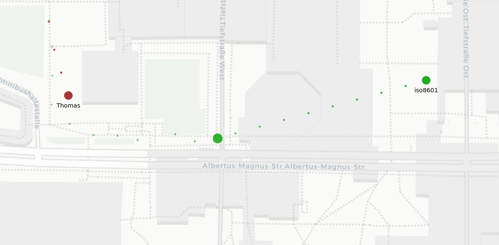

# 24-hackaburg

## Installation

```bash
python3 -m venv .venv
source .venv/bin/activate
pip3 install -r requirements.txt
```

## Maptalks

* Start as webserver: `python -m http.server 8000`

## Log Requests for CaCha App

* The actual locations, that the hunters get sent every 5 minutes, should be logged by the server.

In this case, the hunter got the actual location of the prey in the plot, but in the visualization, it was in the very last part of interpolation, which is why we pinged a older point.
